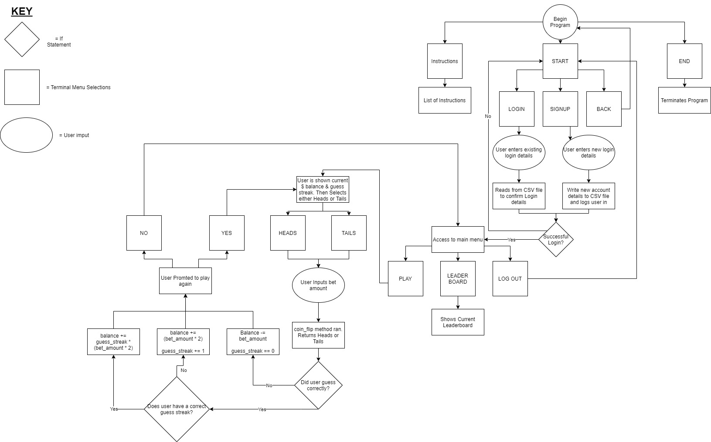

# Brayden O'Gorman - T1A3 Terminal Application

# Software Development Plan

## **Purpose and Scope**

### FlipBet:

### **Describe at a high level what app will do:**

Flip bet is a terminal base application that will allow users to make bets on whether a coin will flip on heads or tails.
The user will begin at $250.
The user will be able to sign-up and log in and out of the app via a username and password.
if the user guesses correctly they will be awarded with double the amount of bet.
if the user guesses incorrectly they will lose the amount they bet
each time a user guesses correctly in a row they will be awarded a multiplier

**Example:**

if user guesses correctly 2 times in a row = 2x multiplier on bet

if user guesses correctly 3 times in a row = 3x multiplier on bet

If user balance reaches $0 they will be returned back to $50 so user can keep playing 
The goal? To beat the current record holder Jeff Bezos who is sitting on $100,000. 
Can you bet correctly to reach the top of the leaderboard?

### **Identify the problem it will solve and explain why you are developing:**
Since the COVID-19 pandemic hit our society last year. It has lead to us to be locked down in our homes for long periods of time.
This has caused a lot of us to be stuck at home with not much to do. 
Whether you just want a break from your daily 9 - 5 grind at home or you are simply bored and want to pass some time. 
Flipbet is a great way to challenge yourself or your friends & family to a simple fun game that anyone can understand!

### **Identify target audience:**

Because this is a Command-line interface based app. Users will need have an intermediate level of computer knowledge
to access the app. Such as computer programers, software engineers or general computer lovers.

### **Explain how a member of the target audience will use it:**

Users will need to have access to a terminal client such as Terminal on macOS or Ubuntu for Windows. 
They will also need Ruby installed on their computer along side with the knowledge to now how to run the ruby application.(Instructions will be added in Help section found at the bottom of README)
Once in the app, users will be prompted with simple instructions on how it works, along side with the easy to use UI to interact with the app.

Users can also use ``ruby main.rb help`` in their terminal to learn how to play Flipbet

### **Features:**

- User will be able to either sign-up or log in and out application via username and password and will be stored in csv file. This will allow the user $ balance and streak to be stored in CSV file and can be accessed once logged in.

- Users will be able to bet a $ amount on whether a coin will flip heads or tails. Coin flip will be randomly generated. If user guesses correctly, they will be awarded with double the amount the originally bet. If user guesses incorrectly they will lose the amount the originally bet.

- User will be awarded with a multiplier bonus for having consecutive correct guesses. The bonus is calculated by multiplying the winning bet by how many consectutive correct guesses they have. The multiplier bonus will be output and shown when user is inputting bet amount

- The current leaderboard can be accessed via the interactive menu. This leaderboard will show where the current user is placed. It will also show the "default" leaders on the leaderboard such as Jeff Bezos on $20,000, Elon Musk on $15,000 and Bill Gates on $10,000.

- Use of TTY-Prompt//TTY-Font/colorize ruby gems to make the user experience more interactive and a lot more fun to play around with.

***

## **User Interaction & Experience**

### **How users will find out how to interact with each function:**
A README.md file can be found in the application folder which has a set of instructions on how to install Flipbet along side its dependencies and also a general overview of how the application works. Instructions found below.

Upon start up of the application, a menu will show 3 options. START, HOW TO PLAY, QUIT. This menu will operated by the use of the keyboard arrow keys and the enter button. A text prompt will tell users how to navigate menu's. If the users selects HOW TO PLAY, the terminal will open and show the user a set of instructions that covers each feature of Flipbet and how to play.

### **How users will interact/use each feature:**

### Sign up/Login: 
Once application has been opened and the user has read through the HOW TO PLAY section. They can return back to the main menu and select the START menu item. Once selected this will lead the user to be prompted to either SIGN UP or LOGIN. If user selects SIGN UP, they will be prompted to then enter a new username and password. This login information will be then stored on a separate CSV file and the user will be then prompted to LOGIN. New users will be given $250 as a starting balance. If the user selects LOGIN, they will be then prompted to enter their username and password. This user data will then be referenced to the CSV file storing their login details. If data matches an entry, user will be granted access to their account and user balance. Once the user has successfully signed up and logged in to their account. They will then be prompted with their current user balance. The user will also have 3 MENU Items to select. PLAY, LEADERBOARD and LOGOUT.

**Error Handling:**
If the user inputs a username that already exists. The user will be prompted informing them that the username already exists and to please try again.

If the user is trying to log in and inputs their username or password incorrectly. They will be prompted with "Incorrect username or password" Please try again.

### Betting on Coin Flip:
If a user selects the PLAY menu option, the user will then be prompted on whether they think a coin flip will land on HEADS or TAILS. Once selected the user will then be prompted to input how much they would like to bet on their guess. The coin flip will then be randomly generated. If user guesses correctly double the amount of their bet will be added to their total balance. If user guesses incorrectly their bet amount will be removed from their total balance. The user will then be asked if they would like to play again. If a users total balance reaches $0. They will be prompted with "YOU LOSE, but here is $50 on the house". Users are then given $50 so that they are able to keep playing.

**Error Handling:**

If the user is trying to input their bet amount and doesn't input an Integer they will be prompted with "Please input a number value only."

If the user tries to bet more than their current $ balance. They will be prompted with "Insufficient funds, Please try again." 

### Multiplier Bonus:
When a user successfully guesses correctly multiple times in a row they will be awarded with a multiplier bonus. An example shown below.

if user guesses correctly 2 times in a row = 2x multiplier on bet.

if user guesses correctly 3 times in a row = 3x multiplier on bet.

### Leaderboard
Once logged in, users will have access to the LEADERBOARD menu option. If selected a leaderboard will be shown in the terminal which is referencing a separate CSV/JSON file. Here a list of local users highscores will be displayed along side some of opponents you are trying to defeat. Such as Jeff Bezos on $20,000, Elon Musk on $15,000 and Bill Gates on $10,000.

### TTY-Prompt/Colorize GEM
I will be using the TTY-Prompt ruby gem to create an easy to use terminal menu that allows users to navigate the menu by using the arrow keys and Enter key. On top of this using Colorize to bring some color to my terminal app. Giving the user a much more enjoying experience.

**Error Handling:**

Luckily TTY-Prompt takes care of quite a lot of the error handling for me as the gem itself handles it. The only times that Errors could occur is through user input. But as stated earlier this is already taken care of through TTY-Prompt.

***

## Control Flow

***
## Implementation Plan

Throughout the planning process I knew I wanted to use an Agile project management process. With the use of Trello this made things a lot easier. If you would like to see an easier to view checklist and time indicators for each feature. Please access the Trello board below.

Link to Trello board: https://trello.com/b/uADKqNR1/t1a3-terminal-app

## Checklist:

### **MVP FEATURES**

**Play:**

As a user, I want to be able to bet my user $ balance on a coinflip. So I can earn more $$ and reach the top of the leaderboard

Users will be able to bet a $ amount on whether a coin will flip heads or tails. Coin flip will be randomly generated. If user guesses correctly, they will be awarded with double the amount the originally bet. If user guesses incorrectly they will lose the amount the originally bet.

- Allow user to input amount of $$ they would like to bet on coin_flip outcome.
- Have a method coin_flip which will randomly output either Heads or Tails.
- Give user ability to select Heads or Tails. Options given through TTY-Prompt. Output selection
- If user guesses correctly, then balance += (bet_amount)
- If user guesses incorreclty, then balance -= bet_amount

**Bet Multiplier**

As a user, I want to be rewarded for having consecutive correct guesses. So I can reach my goal quicker

User will be awarded with a multiplier bonus for having consecutive correct guesses. The bonus is calculated by multiplying the winning bet by how many. Multiplier bonus will be output and shown when user is inputting bet amount

- If user correctly guesses. Add guess_streak += 1. Then add additional If statement which checks if user is currently on a guess_streak of two or more.
- If user incorrectly guesses. Reset guess_streak == 0
- If user is on a guess_streak of two or more. Add method which will multiply the winning bet amount by guess_streak.

***

### **REMAINING FEATURES** 

**Login/Sign up:**

As a user, I want to be able to sign-up or log in to an account. So I can access my user balance and guess streak.

User will be able to either sign-up or log in and out application via username and password and will be stored in csv file. This will allow the user $ balance and guess streak to be stored in CSV file and can be accessed once logged in.

- If user selects sign up. Get them to input both their username and password. output user details into separate user_details CSV File
- If user selects log in, Get user to input username and password. Validate if user details are correct by referencing the to user_details CSV file.
- New user balance is defaulted to $250
- Validate if newly input user details already exist. If details already exist, notify user and get them in input different username
- When user is successfully logged in. They are given access to their personal bet_balance and can continue to main menu

**TTY-Prompt/TTY-Font/Colorize**

As a user, I want to have an easy to use UI. So I have a much more enjoyable time using the app.

Use of TTY-Prompt/TTY-Font/colorize ruby gem to make the user experience more interactive and a lot more fun to play around with.

- bundler TTY-prompt/TTY-Font/colorize and require both
- When application first opens show startup menu with 3 Options. HOW TO PLAY, START, EXIT. User can interact with any menu items by using Arrow keys and Enter key.
- When user selects START. allows user to select LOGIN, SIGN UP, BACK. BACK will take users back to previous menu
- Once successfully logged in. "Main Menu" will show 3 options PLAY, LEADERBOARD, LOG OUT.
- MENU OPTIONS for selecting HEADS or TAILS
- MENU OPTIONS for asking users if they want to play again. YES or NO
- Addition of TTY-Font and Colorize to provide user with a more fun experience

**Leaderboard:**

As a user, I want to be able to access a leaderboard. So I can view my progress compared to other users.

The current leaderboard can be accessed via the interactive menu. This leaderboard will show where the current user is placed. It will also show the "default" leaders on the leaderboard such as Jeff Bezos on $100,00, Elon Musk on $75,000 and Bill Gates on $50,000.

- Give user capability to access current leaderboard.
- update leaderboard entry every time user balance has been changed.
- Add default users to leader board. Example: Jeff Bezos on $100,00, Elon Musk on $75,000 and Bill Gates on $50,000. 

***

## HELP Documentation

### How to install and play:

1. Users must have Ruby installed to be able to run Flip Bet. You can find the documentation to do so [here.](https://www.ruby-lang.org/en/documentation/installation/)

1. Open your terminal/CLI and navigate to where you would like FlipBet to be installed.

1. Clone the app from Github: https://github.com/Brayydzz/BraydenOGorman_T1A3

1. Once Flipbet has been cloned to your computer. Navigate to the ``/src`` directory inside ``/BraydenOGorman_T1A3`` in your terminal
2. Before running Flipbet you must install the required Ruby Gems to play. Once in ``/src`` input ``./install.sh`` in your terminal.
3. Once the Gems are installed. To start Flipbet either input ``./play`` or ``ruby main.rb``. (make sure you are inside the application ``/src`` directory).

  

